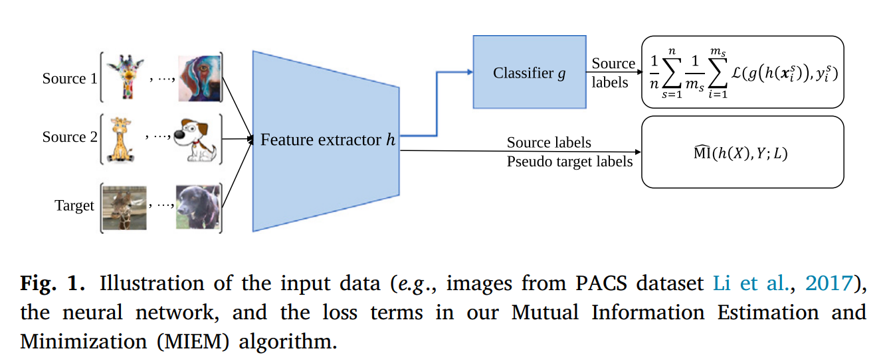

# Mutual Information Estimation and Minimization (MIEM)



This repository provides the Pytorch code for the work "Training multi-source domain adaptation network by mutual information estimation and minimization" published in Neural Networks, 2023. The video for introducing this work will soon be available in this repository as well.

In the work, we address the Multi-Source Domain Adaptation (MSDA) problem. MSDA aims to train a neural network using multiple labeled source datasets and an unlabeled target dataset, and expects the trained network to well classify the unlabeled target data. The main challenge in this problem is that the datasets are generated by relevant but different joint distributions. To address this challenge, we propose to estimate and minimize the mutual information in the network latent feature space, which leads to the alignment of the source joint distributions and target joint distribution simultaneously. The estimation of mutual information is formulated into a convex optimization problem, whose global optimal solution can be easily found. 


#### Dataset folder
The folder structure required (e.g PACS)
- data
  - PACS
    - list
      - art_painting.txt
      - cartoon.txt
      - photo.txt
      - sketch.txt
    - art_painting
    - cartoon
    - photo
    - sketch

##### How to run

```bash
python demo.py  --net resnet --dataset PACS --num_class 7 --source art_painting cartoon photo --target sketch --gpu 0 --seed 0 | tee MIEM_resnet[art_painting_cartoon_photo]Tosketch_seed0.log
```

For more details of this multi-source domain adaptation approach,  please refer to the following work: 

@article{Wen2024Training,    
title = {Training multi-source domain adaptation network by mutual information estimation and minimization},    
journal = {Neural Networks},    
volume = {171},    
pages = {353-361},    
year = {2024},   
url = {https://www.sciencedirect.com/science/article/pii/S089360802300727X},   
author = {Lisheng Wen and Sentao Chen and Mengying Xie and Cheng Liu and Lin Zheng}   
}

  
The Pytorch code is currently maintained by Lisheng Wen. If you have any questions regarding the code, please contact Lisheng Wen via the email lishengwenmail@126.com.
